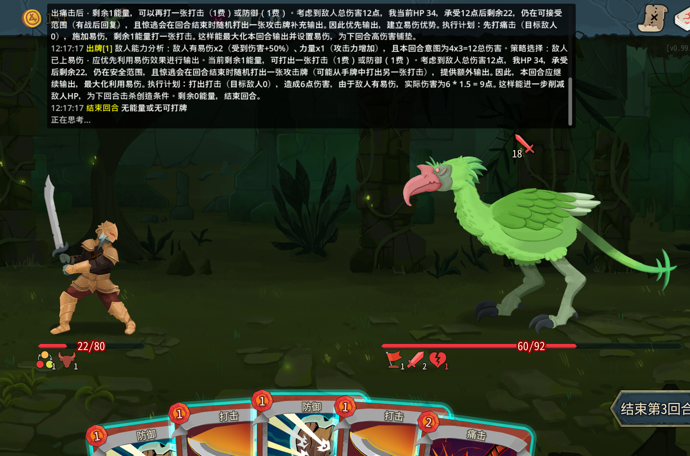

中文 | [**English**](README_EN.md)

# AI Spire 🃏🤖

用 LLM 自动玩杀戮尖塔 2 (Slay the Spire 2) 的 AI Mod。

AI 会实时分析战斗状态、手牌、敌人意图，通过 DeepSeek 等 LLM API 做出决策，自动出牌、使用药水、选择地图路径。

## 特性

- **LLM 驱动决策**：调用 DeepSeek/OpenAI 兼容 API，基于完整游戏状态做出牌决策
- **多轮对话**：每场战斗维护完整上下文，AI 能记住之前的决策和结果
- **codex 数据集成**：加载 [spire-codex](https://github.com/ptrlrd/spire-codex) 的中文卡牌/怪物/能力/遗物数据，向 LLM 提供精确的伤害、格挡、招式等数值
- **实时意图识别**：从游戏中提取敌人本回合确切意图（攻击伤害/类型），codex 补充后续可能招式供 AI 长远规划
- **规则引擎兜底**：LLM 调用失败时自动切换到规则引擎，保证不卡死
- **游戏内 Overlay**：顶部居中半透明面板实时显示 AI 每步决策和推理过程
- **能力/遗物理解**：向 LLM 提供所有 Buff/Debuff 和遗物的详细效果描述，支持能力联动的多回合规划
- **双语支持**：自动检测游戏语言（中/英文），Prompt 和 UI 自动适配

## 前置要求

- **Slay the Spire 2** (Steam, v0.98+)

## 安装与使用

### 1. 下载 Mod

前往 [Releases 页面](https://github.com/biolbe1230/ai-spire/releases/tag/v0.1.0)，下载最新的 **AISpire.zip**。

### 2. 放置文件

将压缩包解压到杀戮尖塔 2 的 `mods` 目录下：

```
{杀戮尖塔2安装目录}/mods/AISpire/
```

> **找到安装目录**：Steam 中右键游戏 → 管理 → 浏览本地文件

解压后目录结构应为：

```
mods/
└── AISpire/
    ├── AISpire.dll          # Mod 主体
    ├── AISpire.json         # Mod 清单
    ├── config.json          # 配置文件（需要编辑）
    └── data/                # 游戏数据
        ├── en/              # 英文数据
        │   ├── cards.json
        │   └── monsters.json
        │   ...
        └── zhs/             # 中文数据
            ├── cards.json
            └── monsters.json
            ...
```

> ⚠️ 以上所有文件都是必需的，请勿删除。

### 3. 配置 API Key

编辑 `mods/AISpire/config.json`，填入你的 LLM API 密钥：

```json
{
  "api_key": "sk-你的API密钥",
  "api_endpoint": "https://api.deepseek.com/v1/chat/completions",
  "model": "deepseek-chat"
}
```

| 配置项 | 说明 | 默认值 |
|--------|------|--------|
| `api_key` | LLM API 密钥 | （必填） |
| `api_endpoint` | API 地址，兼容 OpenAI 格式 | DeepSeek |
| `model` | 模型名 | `deepseek-chat` |
| `api_timeout_ms` | API 请求超时（毫秒） | `15000` |
| `max_retries` | 失败重试次数 | `1` |
| `enabled` | AI 总开关 | `true` |
| `action_delay_ms` | 出牌间隔（毫秒），防止过快 | `500` |
| `verbose_logging` | 详细日志 | `true` |
| `max_history_messages` | 多轮对话最大历史消息数 | `40` |
| `language` | 语言：`"auto"`（跟随游戏）、`"en"`、`"zhs"` | `"auto"` |

### 4. 启动游戏

正常启动杀戮尖塔 2，Mod 会自动加载。进入战斗后 AI 将接管操作，同时也会处理事件、地图选择、商店、休息点、宝物房和卡牌奖励。

---

<details>
<summary><b>从源码构建（开发者）</b></summary>

#### 环境要求

- .NET 9.0 SDK
- Godot .NET SDK 4.5.1（NuGet 自动还原）

#### 步骤

1. 克隆仓库：`git clone --recurse-submodules https://github.com/biolbe1230/ai-spire.git`
2. 编辑 `AISpire.csproj`，将 `Sts2Dir` 改为你的杀戮尖塔 2 安装目录：
   ```xml
   <Sts2Dir>D:\SteamLibrary\steamapps\common\Slay the Spire 2</Sts2Dir>
   ```
3. 复制配置模板：`cp config.example.json config.json`，填入 API Key
4. 编译：`dotnet build`

编译后会自动将 DLL、config.json 和游戏数据复制到 `{Sts2Dir}/mods/AISpire/`。

</details>

## 项目结构

```
ai-spire/
├── Scripts/
│   ├── Entry.cs                 # Mod 入口，Harmony 补丁注册
│   ├── Config/
│   │   ├── AIConfig.cs          # 配置管理（读取 config.json）
│   │   └── Loc.cs               # 双语本地化（中/英文）
│   └── AI/
│       ├── AIDecisionEngine.cs  # 决策引擎主控，多轮对话管理
│       ├── LLMClient.cs         # LLM API 调用
│       ├── PromptBuilder.cs     # Prompt 构建（含游戏规则、策略指导）
│       ├── GameStateExtractor.cs# 游戏状态提取（手牌/敌人/能力/遗物）
│       ├── GameStateModel.cs    # 状态数据模型
│       ├── GameDataLoader.cs    # spire-codex JSON 数据加载
│       ├── RuleEngine.cs        # 规则引擎（LLM 兜底）
│       ├── ActionExecutor.cs    # 动作执行（出牌/结束回合等）
│       ├── ScreenHandler.cs     # 覆盖屏幕处理（奖励/升级等）
│       └── AIOverlay.cs         # 游戏内推理显示面板
├── spire-codex/                 # 游戏数据 (git submodule)
├── config.json                  # 用户配置（不提交到 git）
├── config.example.json          # 配置模板
├── AISpire.csproj               # 项目文件
├── AISpire.json                 # Mod 清单
└── project.godot                # Godot 项目文件
```

## 工作原理

```
回合开始
    │
    ▼
提取游戏状态（手牌、能量、敌人意图、能力、遗物）
    │
    ▼
构建 Prompt（含 codex 精确数值 + 游戏规则 + 策略指导）
    │
    ▼
调用 LLM API（多轮对话，携带战斗历史）
    │         │
    │ 成功    │ 失败
    ▼         ▼
LLM 决策    规则引擎兜底
    │         │
    ▼         ▼
执行动作（出牌/药水/结束回合）
    │
    ▼
Overlay 显示决策理由
    │
    ▼
循环（直到结束回合）
```

## Roadmap

- [x] **双语支持** — 英文 Prompt / codex 英文数据切换，自动检测游戏语言
- [x] **全游戏流程支持** — 事件选择、商店购买、卡牌奖励筛选、休息/升级决策等非战斗场景的完整 AI 接管
- [ ] **除了战士的角色支持** — 目前只支持战士，因为交互逻辑较为简单，后续支持其它角色
- [ ] **多样化策略支持** — 可选策略配置（激进/保守/速通），针对不同角色和流派的定制化 Prompt
- [ ] **实时用户干预** — 游戏内快捷键暂停 AI、手动接管某回合、修改 AI 策略倾向

## 致谢

- [spire-codex](https://github.com/ptrlrd/spire-codex) — 杀戮尖塔 2 游戏数据


## License

MIT
